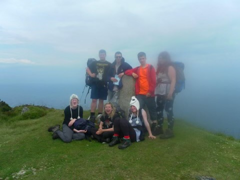
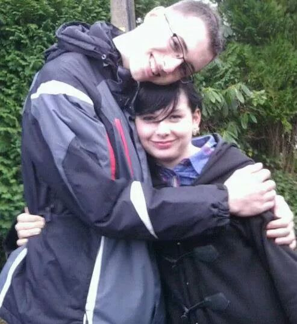

---
export_on_save:
  html: true

html:
  embed_local_images: false
  embed_svg: true
  offline: False
  toc: False

print_background: false
---

# Our Story

| [Home](index.html) | [Our Story](ourstory.html) |
| ------------------ | -------------------------- |

## When we first met

We first met on a school trip to the Isle of Arran in Summer 2012. Roxy's first impression of me was on the minibus, when I shouted 'I have a portable charger, five pounds for anyone who wants to use it.' She thought, wow, what a geek. Roxy, of course, took me up on this offer and proceeded to drain it all.

## When we knew

I knew I wanted to ask Roxy out when we went sledging. She'd dropped her sledge and I had to walk 3 miles to go and find it in the snow bank.

I knew I wanted to be with Jo, yet again when we went sledging. My gloves got soaked making a pillow out of snow for Jo, so he gave me his waterproof gloves.

## Our first photo as a couple

Our first photo was taken after Roxy's first visit to my house while I was walking her home.

## Our first date

We went for ice cream and sat on The Rock Shop bench. This was also my first visit to Roxy's house.

## The Proposal

I proposed to Roxy at Carisbrooke Castle, as she's always been a history buff. I wanted to make it special.

For the first time in her life, Roxy was speechless. This was of course after she shouted at me to ensure this wasn't a practical joke.
